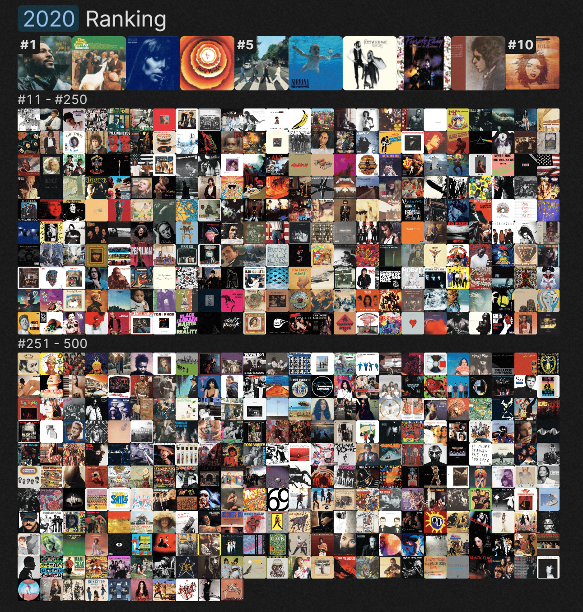

```{r setup, include=FALSE}
knitr::opts_chunk$set(echo = TRUE)
```

```{r, include = FALSE}
Albums <- read.csv('Project1_Albums.csv') #Reading in the data set 
library(ggplot2) #Using ggplot graphs for figures
```

***

# **1. Introduction**

Analyzing the top 500 ranked albums according to the Rolling Stone in 2020. The dataset itself was collected by gathering ranked ballots from over 300 artists, critics, producers, and music industry figures.

The variables in the data set are as follows.

 **Artist-** The person or group that produced the music.
 **Album-** The collection of songs released together by the artist.
 **Release year-** When the album was released.
 **Genre-** The unique musical styles included in the album.
 **Type-** How the album was put together.
 **Weeks on billboard-** How many weeks the album was on the Hot 100 chart which is a ranked list of 100 popular songs and albums published each week.
 **Peak billboard position-** The most popular an album got in rankings.
 **Spotify popularity-** A complex calculation which involves number of plays, user engagement, skip rate, and share of total plays. The higher the score the more popular a song is interpreted to be.
 **Artist member count-** The number of individuals that make up the band or 1 if a single artist.
 **Rank 2020-** The aggregate rankings calculated from each judge's own ranked list of 50 albums.
 **(weighted billboards)** Weeks on billboard divided by peak billboard position.

 For this analysis I will be focusing on Spotify popularity for the outcome variable of interest. For the predictors I will be investigating genre, weighted billboards, and their 2020 ranking.


Rolling stone 2020 top 500 ranked albums, sourced from The Pudding Visual Essays link in conclusion.

***

# **2. Analyzing the output variable**

```{r echo=FALSE}
Al_ggplot <- ggplot(Albums) #Setting up the albums dataset for ggplot

Al_ggplot + geom_histogram(aes(x=spotify_popularity), binwidth=2, na.rm=TRUE, show.legend=FALSE, fill='deepskyblue3') + theme_classic() + labs(title='Distribution of spotify popularity scores', x='Spotify popularity score (0-100)',y='Number of albums') #Simple histogram plot
```

The distribution of Spotify popularity scores looks normal with a slight skew to the left. Some of the calculated statistics include a minimum Spotify popularity score of `r round(min(Albums$spotify_popularity, na.rm=TRUE),2)`, a first quartile of `r round(quantile(Albums$spotify_popularity,.25, na.rm=TRUE),2)`, a median of `r round(median(Albums$spotify_popularity, na.rm=TRUE),2)`, a third quartile of `r round(quantile(Albums$spotify_popularity,.75, na.rm=TRUE),2)`, and a max of `r round(max(Albums$spotify_popularity, na.rm=TRUE),2)`.

***

# **3. Bivariate analysis**
```{r echo=FALSE}
Al_ggplot + geom_boxplot(aes(y=genre, x=spotify_popularity, fill=genre), na.rm=TRUE) + theme_classic() + labs(title='Spotify popularity', x='Spotify popularity score (0-100)') #Standard boxplot separated by genre 
```

This graph shows the distribution of Spotify popularity scores separated by genre. Its interesting to note that most median scores don't stray far from the median score calculated from the whole dataset of 500 albums. From this graph Latin music has the highest median Spotifiy popularity score of `r round(median((Albums$spotify_popularity[Albums$genre == 'Latin']), na.rm=TRUE),2)`. While Afrobeat has the lowest median spotify popularity score of `r round(median((Albums$spotify_popularity[Albums$genre == 'Afrobeat']), na.rm=TRUE),2)`. I should note I excluded Blues/Blues ROck because there's a strong possibility it was a typo while entering data.

Table of genre popularity scores. (excluded Blues/Blues ROck, 1 album)

```{r, include=FALSE}
#The sums and median statistics of genres
```
|Genre|Number Of Albums|Median Spotify Popularity Score|
|-----------|-----------|-----------|
|Afrobeat|`r sum(Albums$genre == 'Afrobeat', na.rm=TRUE)`|`r round(median(Albums[Albums$genre == 'Afrobeat', 'spotify_popularity'], na.rm=TRUE),2)`|
|Big Band/Jazz|`r sum(Albums$genre == "Big Band/Jazz", na.rm=TRUE)`|`r round(median(Albums[Albums$genre == "Big Band/Jazz", 'spotify_popularity'], na.rm=TRUE),2)`|
|Blues/Blues Rock|`r sum(Albums$genre == 'Blues/Blues Rock', na.rm=TRUE)`|`r round(median(Albums[Albums$genre == 'Blues/Blues Rock', 'spotify_popularity'], na.rm=TRUE),2)`|
|Country/Folk/Country Rock/Folk Rock|`r sum(Albums$genre == 'Country/Folk/Country Rock/Folk Rock', na.rm=TRUE)`|`r round(median(Albums[Albums$genre == 'Country/Folk/Country Rock/Folk Rock', 'spotify_popularity'], na.rm=TRUE),2)`|
|Electronic|`r sum(Albums$genre == 'Electronic', na.rm=TRUE)`|`r round(median(Albums[Albums$genre == 'Electronic', 'spotify_popularity'], , na.rm=TRUE),2)`|
|Funk/Disco|`r sum(Albums$genre == 'Funk/Disco', na.rm=TRUE)`|`r round(median(Albums[Albums$genre == 'Funk/Disco', 'spotify_popularity'], , na.rm=TRUE),2)`|
|Hard Rock/Metal|`r sum(Albums$genre == 'Hard Rock/Metal', na.rm=TRUE)`|`r round(median(Albums[Albums$genre == 'Hard Rock/Metal', 'spotify_popularity'], , na.rm=TRUE),2)`|
|Hip-Hop/Rap|`r sum(Albums$genre == 'Hip-Hop/Rap', na.rm=TRUE)`|`r round(median(Albums[Albums$genre == 'Hip-Hop/Rap', 'spotify_popularity'], , na.rm=TRUE),2)`|
|Indie/Alternative Rock|`r sum(Albums$genre == 'Indie/Alternative Rock', na.rm=TRUE)`|`r round(median(Albums[Albums$genre == 'Indie/Alternative Rock', 'spotify_popularity'], , na.rm=TRUE),2)`|
|Latin|`r sum(Albums$genre == 'Latin', na.rm=TRUE)`|`r round(median(Albums[Albums$genre == 'Latin', 'spotify_popularity'], , na.rm=TRUE),2)`|
|Punk/Post-Punk/New Wave/Power Pop|`r sum(Albums$genre == 'Punk/Post-Punk/New Wave/Power Pop', na.rm=TRUE)`|`r round(median(Albums[Albums$genre == 'Punk/Post-Punk/New Wave/Power Pop', 'spotify_popularity'], , na.rm=TRUE),2)`|
|Reggae|`r sum(Albums$genre == 'Reggae', na.rm=TRUE)`|`r round(median(Albums[Albums$genre == 'Reggae', 'spotify_popularity'], , na.rm=TRUE),2)`|
|Rock n'Roll/Rhythm & Blues|`r sum(Albums$genre == "Rock n' Roll/Rhythm & Blues", na.rm=TRUE)`|`r round(median(Albums[Albums$genre == "Rock n' Roll/Rhythm & Blues", 'spotify_popularity'], , na.rm=TRUE),2)`|
|Singer-Songwriter/Heartland Rock|`r sum(Albums$genre == 'Singer-Songwriter/Heartland Rock', na.rm=TRUE)`|`r round(median(Albums[Albums$genre == 'Singer-Songwriter/Heartland Rock', 'spotify_popularity'], , na.rm=TRUE),2)`|
|Soul/Gospel/R&B|`r sum(Albums$genre == 'Soul/Gospel/R&B', na.rm=TRUE)`|`r round(median(Albums[Albums$genre == 'Soul/Gospel/R&B', 'spotify_popularity'], , na.rm=TRUE),2)`|
|NA|`r sum(is.na(Albums$genre))`|-|

***

```{r echo=FALSE}
Albums$weighted_billboard <- Albums$weeks_on_billboard / Albums$peak_billboard_position #The idea is the higher on the board for longer = higher score with a lower position for the same number of weeks being devalued.
```

```{r echo=FALSE}
ggplot(Albums, aes(x=weighted_billboard, y=spotify_popularity), na.rm=TRUE) + geom_point(na.rm=TRUE, color='deepskyblue2') + geom_smooth(formula = y ~ x, method = "lm", se = FALSE, na.rm=TRUE, color='deepskyblue4') + theme_classic() + labs(title='Weighted billboard vs. spotify popularity score', x='Weighted billboard',y='Spotify popularity score') #Standard point graph
```

Created a new variable called weighted billboard which was calculatd by dividing weeks on billboard by peak billboard position. With the intention being to find the correlation between Spotify popularity and a variable that better represents how popular a song was according to the billboard. With high ranked albums that stayed on the billboard for many weeks having a higher weighted billboard score than an album that ranked lower and stayed on for the same number of weeks.

There is a moderate correlation between the weighted billboard and the album's spotifiy popularity with a calculated correlation value of `r round(cor(Albums$weighted_billboard, Albums$spotify_popularity, use='complete.obs'),2)`.

***

```{r echo=FALSE}
ggplot(Albums, aes(x=rank_2020, y=spotify_popularity), na.rm=TRUE) + geom_point(na.rm=TRUE, color='chartreuse3') + geom_smooth(formula = y ~ x, method = "lm", se = FALSE, na.rm=TRUE, color='chartreuse4') + theme_classic() + labs(title="Album's 2020 ranking vs. spotify popularity score", x='2020 ranking',y='Spotify popularity score') #Standard point graph
```

It's interesting to see how there is little correlation between an album's Spotify popularity score and its 2020 ranking by Rolling Stone. The actual calculated correlation value was `r round(cor(Albums$rank_2020, Albums$spotify_popularity, use='complete.obs'),2)`, this may mean the Spotify population score algorithm is inaccurate to how people would broadly determine which albums are the best.

***

# **Multivariate analysis with Spotify popularity**

```{r echo=FALSE}
ggplot(Albums, aes(x=rank_2020, y=weighted_billboard, color=spotify_popularity), na.rm=TRUE) + geom_point(na.rm=TRUE) + geom_smooth(formula = y ~ x, method = "lm", se = FALSE, na.rm=TRUE, color='black') + theme_classic() + labs(title="Album's 2020 ranking vs. weighted billboard, with spotify popularity colored in", x='2020 ranking',y='Weighted billboards') #Standard point graph
```

This graph shows some interesting correlations between weighted billboards and rank 2020. There is a very weak negative correlation between rank 2020 and weighted billboard with a calculated correlation value of `r round(cor(Albums$rank_2020, Albums$weighted_billboard, use='complete.obs'),2)`.

In addition the Spotify popularity variable still shows little correlation with rank 2020 while having some positive correlation with weighted billboards like it was shown to have in the second bivariate analyses graph.

***

# **4. Choice Elements**

I used 2 or more in-line codes within my report in the bivariate graph explanations and in the outcome variable graph explanation.

I included 2 working hyper links in the conclusion that point to an explanation of the data set and to an explanation of how the data was collected.

I included a floating table of contents for the bolded headers.

Created a new variable called weighted billboard for one bivariate analysis.

Created a multivariate plot at the end of the bivariate section that desplayed the relationship between 2 predictor variables and the outcome variable.

***

# **5. Conclusion**

In conclusion the Spotify popularity of albums is very weakly correlated to the 2020 rankings of albums by Rolling Stone. In addition Spotify popularity is moderately correlated with weighted billboards. Another interesting conclusion is that while genre plays some role in the Spotify popularity score distribution of the album it does not seem to have a major effect on the median popularity score relative to other genres.

The fact that Spotify popularity which is supposed to broadly mirror which songs people like the most doesn't correlate much with the 2020 rankings is curious. In the future I suggest looking into the different variables involved in calculating Spotify popularity to dig into why the 2020 rankings don't reflect Spotify popularity scores or vice versa.

About that one Blues/Blues ROck album I excluded, I navigated to the spreadsheet that contains the data(link to google sheet at bottom of first source) and found this.

I'm confident in hindsight that this was a typo.


* Sources for this analysis
  + [More about the data](https://pudding.cool/2024/03/greatest-music/) What makes an album the greatest of all time?
by Chris Dalla Riva and Matthew Daniels(The Pudding Visual Essays).
  + [How the data was collected](https://www.rollingstone.com/music/music-lists/best-albums-of-all-time-1062063/) Rolling Stone, The 500 Greatest Albums of All Time.
  + [Spotify popularity score         explained](https://www.loudlab.org/blog/spotify-popularity-leverage-algorithm/) An in depth guide to using popularity score by Loudlab.

***

